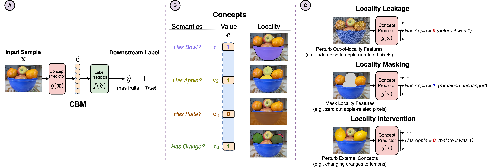

# Do Concept Bottleneck Models Respect Localities



This repository contains the implementation for the paper ["Do Concept Bottleneck Models Respect Localities"](https://arxiv.org/abs/2401.01259), previously published at the NeurIPs 2023 Workshop "XAI in Action: Past, Present, and Future Applications".

This work was done by [Naveen Raman](https://naveenraman.com/), [Mateo Espinosa](https://hairyballtheorem.com/), [Juyeon Heo](https://sites.google.com/view/juyeonheo/), and [Mateja Jamnik](https://www.cl.cam.ac.uk/~mj201/). 

#### TL;DR
Concept-based methods require accurate concept predictors, yet the faithfulness of existing concept predictors to their underlying concepts is unclear.
To better understand this, we investigate the faithfulness of Concept Bottleneck Models (CBMs), a popular family of concept-based architectures, by looking at whether they respect "localities" in datasets. 
Localities involve using only relevant features when predicting concepts. 
When localities are not considered, concepts may be predicted based on spuriously correlated features, degrading performance and robustness. 
This work examines how CBM predictions change when perturbing model inputs, and reveals that CBMs may not capture localities, even when independent concepts are localised to non-overlapping feature subsets. 
Our empirical and theoretical results demonstrate that datasets with correlated concepts may lead to accurate but uninterpretable models that fail to learn localities. 

We provide code here which evaluates CBMs for the following experiments: 
1. Synthetic Evaluations where we vary model size, dataset complexity, etc.
2. Locality masking with the CUB and COCO datasets
3. Localty intervention experiments to understand locality in counterfactual scenarios
4. Methods to mitigate locality-based issues, such as pruning, label-free CBMs, and variations on training

For each experiment, we provide a Jupyter notebook, which details how to run the expermient for one set of parameters, and a bash script, which details how to run the experiment across all parameters. 
Additionally, we provide the code to reproduce all plots in the ```scripts/notebooks/Plotting.ipynb```. 

## Citation
If you use our code for your research, please cite this as
```
@article{raman2024concept,
  title={Do Concept Bottleneck Models Obey Locality?},
  author={Raman, Naveen and Zarlenga, Mateo Espinosa and Heo, Juyeon and Jamnik, Mateja},
  journal={arXiv preprint arXiv:2401.01259},
  year={2024}
}
```

## Installation and Datasets
### Installation
To install dependencies, run the following
```
$ conda env create --file environment.yaml
$ python setup.py install
```

### Datasets
For our synthetic experiments, the datasets are downloadable from <a href="https://cmu.box.com/s/4omue1ywnoboqm7tmh1rv4j1qg240p0g">here</a>. 
Extract this file into the datasets/synthetic_object folder. 

We additionally use two external datasets: CUB and COCO:

1. **CUB:** We download the CUB dataset from <a href="https://www.vision.caltech.edu/datasets/cub_200_2011/">here</a>. 
2. **COCO:** We download the COCO dataset from <a href="https://cocodataset.org/#home">here</a>. 

Place the images for each dataset into two folders, named ```datasets/CUB/images``` and ```datasets/coco/images``` respectively. 

### Models
To download trained versions of each of our models, use the link <a href="https://cmu.box.com/s/usy4h34vp51bsoeafot7jf79i9uc8cg5">here</a>. 

Similarly, to download our results, use the link <a href="https://cmu.box.com/s/8mvnvpwzfrowgbs53ua2biyn7t3wc6cu">here</a>. 

## Synthetic Experiments
Our synthetic experiments are largely built off of our Jupyter notebook: ```scripts/notebooks/Synthetic Experiments.ipynb```. 
This notebook first loads in a synthetic model, and evaluates it according to the locality leakage metric. 

These experiments can be automatically run through scripts titled: ```scripts/bash_scripts/analyze_models/run_synthetic...```

Training models is done through: ```ConceptBottleneck/train_cbm.py```. 

Scripts to train models can be found: ```scripts/bash_scripts/train_models.sh```

All trained models will be stored in the ```models/``` folder. 

## Locality Masking
The notebook corresponding to our locality masking experiments can be found at: ```scripts/notebooks/CUB Analysis.ipynb``` and ```scripts/notebooks/Coco Analysis.ipynb```. 

The corresponding bash scripts: ```scripts/bash_scripts/analyze_models/run_cub.sh``` and ```scripts/bash_scripts/analyze_models/run_coco.sh```

Models for CUB and COCO can be trained through the scripts: ```scripts/bash_scripts/train_models/train_cub.sh``` and ```scripts/bash_scripts/train_models/train_coco.sh```

## Locality Intervention
The notebook corresponding to our locality intervention experiments can be found at: ```scripts/notebooks/Synthetic Correlation.ipynb```

The corresponding bash script is: ```scripts/bash_scripts/analyze_models/run_synthetic_correlation.sh```. 

## Mitigating Locality-Based Issues
We construct experiments to analyze the impact of different methods upon improving the locality-related properties of CBMs. 
1. **Pruning**: ```scripts/notebooks/CUB Pruning.ipynb``` and ```scripts/notebooks/Coco Pruning.ipynb```
2. **Label Free CBMs**: ```scripts/notebooks/CUB Label Free.ipynb```
3. **Training Modifications**: ```scripts/notebooks/CUB Analysis.ipynb``` and ```scripts/notebooks/Coco Analysis.ipynb```